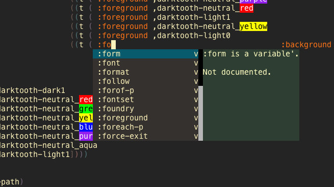
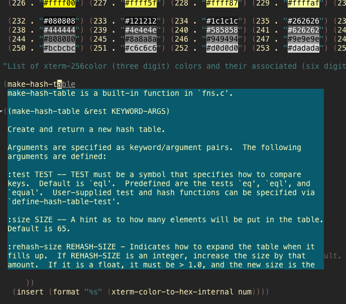
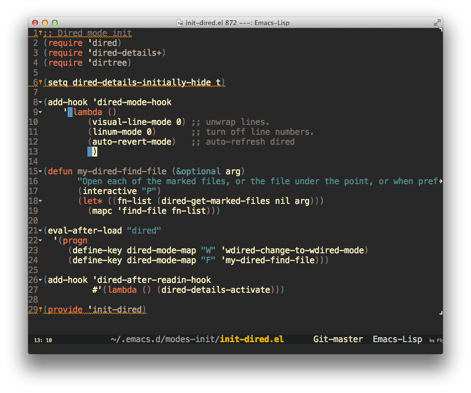
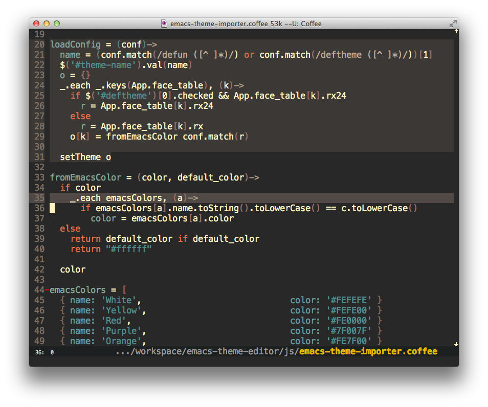
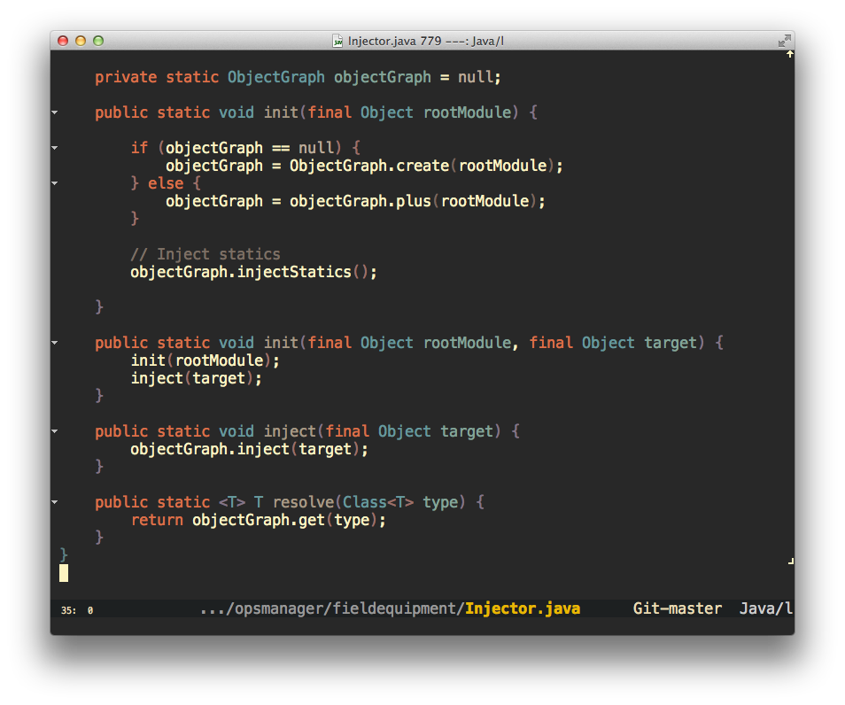
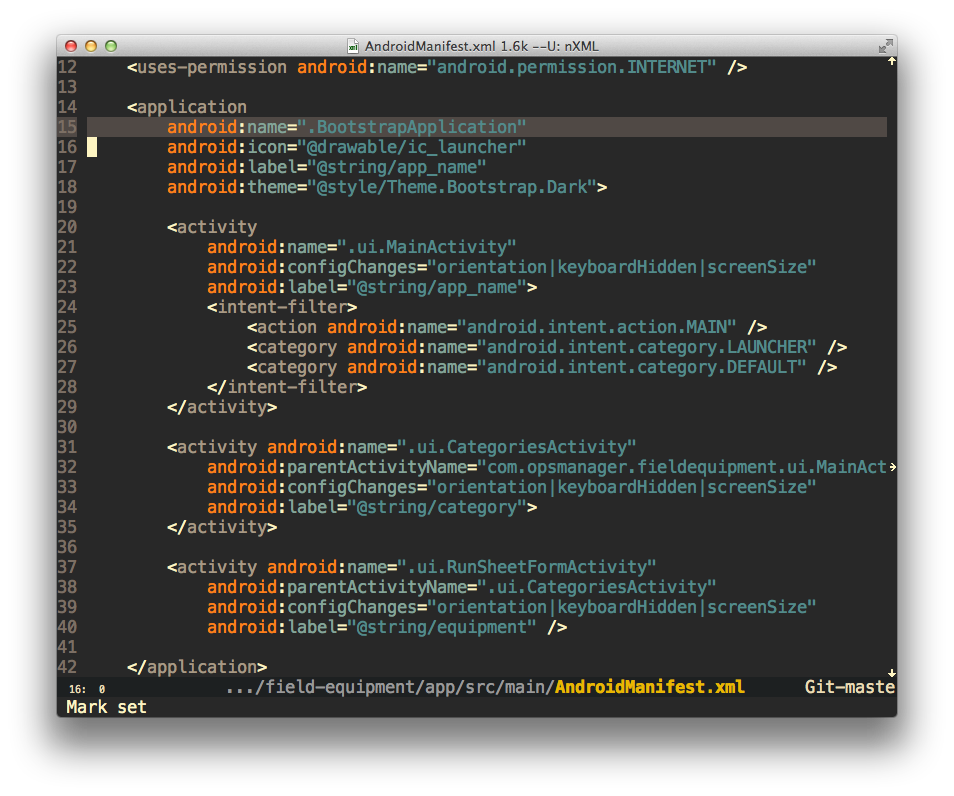
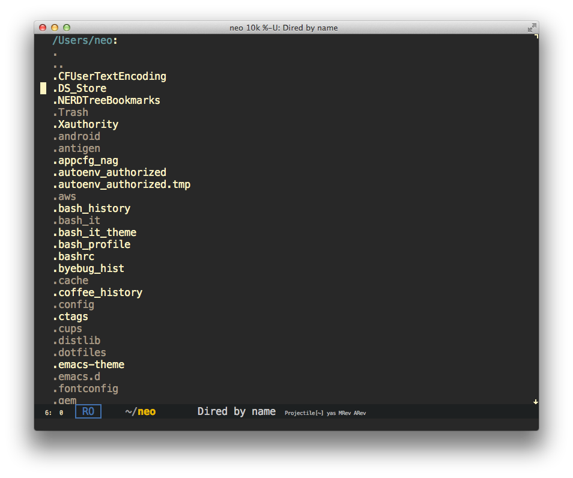

[](http://stable.melpa.org/#/darktooth-theme) [](http://melpa.org/#/darktooth-theme)


a theme for Emacs

## Installation

Darktooth is easily installed via MELPA.  [Read more here for MELPA setup details](http://melpa.org/#/getting-started)

When your Emacs is setup to use MELPA do this:

```
M-x package-install darktooth-theme
```

## Modes supported

- ac-dabbrev
- ag (The Silver Searcher)
- anzu
- auctex
- avy
- col-highlight
- column-enforce-mode
- column-marker
- company
- diff
- diff-hl
- diff-indicator
- dired+
- el-search
- eldoc
- elfeed
- elixir-mode
- elscreen
- embrace
- erc
- flycheck
- flymake
- git-gutter
- git-gutter+
- git-gutter-fr
- git-gutter-fr+
- haskell
- helm
- helm-swoop
- hi-lock
- highlight-indentation-mode
- highlight-numbers
- highlight-symbol
- hydra
- ido
- isearch
- ivy
- linum-relative
- magit
- man
- message
- org-mode
- popup
- powerline
- rainbow-delimiters
- rainbow-identifiers
- ripgrep
- sh mode
- show-paren
- smart-mode-line
- smartparens
- smerge
- swoop
- term / ansi-colors
- tldr
- vline
- web
- which-func
- which-key
- whitespace-mode
- woman

# Palette


# Miscellany


### The Fabled Darktooth Keyboard...


### Darktooth Mode line

There's an optional modeline theme available, run `(darktooth-modeline)`:

**Darktooth modeline - screenshot**


### Screenshots

##### Popup Menu



##### Popup Tip



##### Emacs Lisp



##### CoffeeScript



##### Java



##### XML



##### Dired



##### Terminal (xterm256 / iTerm)


Inspired by:

[gruvbox](https://github.com/Greduan/emacs-theme-gruvbox)
[soothe](https://github.com/emacsfodder/emacs-soothe-theme)
